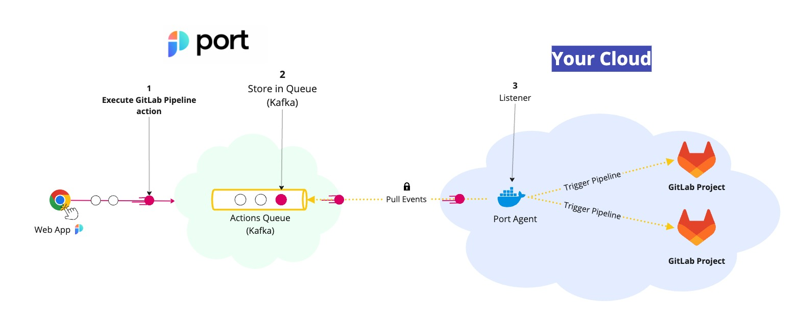

# GitLab Pipelines Actions

Glint's GitLab Pipeline Action can trigger a [GitLab Pipeline](https://docs.gitlab.com/ee/ci/pipelines/) using a customer provided input and [`port_payload`](/create-self-service-experiences/reflect-action-progress/#action-run-json-structure).

The steps shown in the image above are as follows:

1. Glint publishes an invoked `Action` message containing the pipeline details to a topic;
2. A secure topic (`ORG_ID.runs`) holds all the action invocations;
3. Glint's execution agent pulls the new trigger event from your Kafka topic, and triggers your GitLab Pipeline.

## Further steps

- See the [deployment example](./examples/run-service-deployment.md) for GitLab pipelines.
- Contact us through Intercom to set up a Kafka topic for your organization.
- [Install the Glint execution agent to triggering the GitLab pipelines](./Installation.md).
- [Learn how to customize the payload sent to gitlab api](./Installation.md#control-the-payload).
