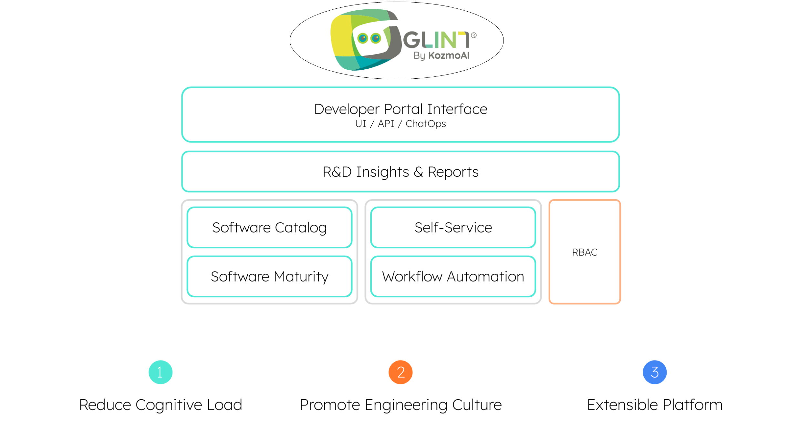

# Glint overview

<iframe width="60%" height="400" src="https://www.youtube.com/embed/z2kR9HSRIpQ" title="YouTube video player" frameborder="0" allow="accelerometer; autoplay; clipboard-write; encrypted-media; gyroscope; picture-in-picture; web-share" allowfullscreen allow="fullscreen;"></iframe>

## Get started with Glint

Trying out Glint for yourself is free and easy, simply [create an account](https://app.useglint.io) and follow the quick onboarding process.  
The [Getting started](/quickstart) page will walk you through the different components of your portal and the value they provide.

## What is Glint

Welcome to Glint! :wave:

Internal developer portals need a context-rich software catalog with maturity and quality scorecards. They also must support comprehensive developer self-service actions. Glint has it all.

### Glint product pillars

#### Software Catalog

Give developers a holistic understanding of your development lifecycle and underlying architecture. Reduce cognitive load resulting from complex architectures, tool proliferation, and tribal knowledge.

[Software Catalog live demo](https://demo.useglint.io/service_catalog) 🎬

#### Self-Service

Drive developer productivity by allowing developers to run free and use self-service actions like scaffolding a service or provisioning a cloud resource.

[Self Service live demo](https://demo.useglint.io/self-serve) 🎬

#### Software maturity

Glint scorecards let you define and track standards and KPIs for quality, production readiness, productivity, and more. Drive visibility and a culture of software quality.

[Software Maturity Live Demo](https://demo.useglint.io/serviceEntity?identifier=authentication&activeTab=5) 🎬

#### Workflow automation

With Glint, you can set up automations to automatically respond to events from your software catalog such as `TTL=0`, service degradation, and many more. This allows you to streamline your engineering processes, maintain a high level of performance, security, and compliance, and ensure your systems run smoothly.

[Workflow Automation Live Demo ](https://demo.useglint.io/self-serve) 🎬

#### R&D Insights & Reports

R&D Insights & Reports is a pillar of glint that provides data-driven insights and analytical reports on the development process. It allows teams, developers, and management to make informed decisions based on metrics, trends, and usage patterns to improve the development process, optimize performance, and reduce cost.

[Insights & Reports live demo](https://demo.useglint.io/svp_engineering) 🎬
