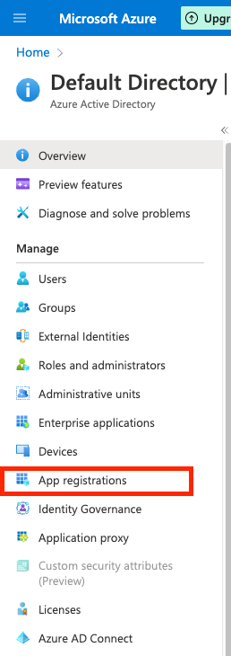
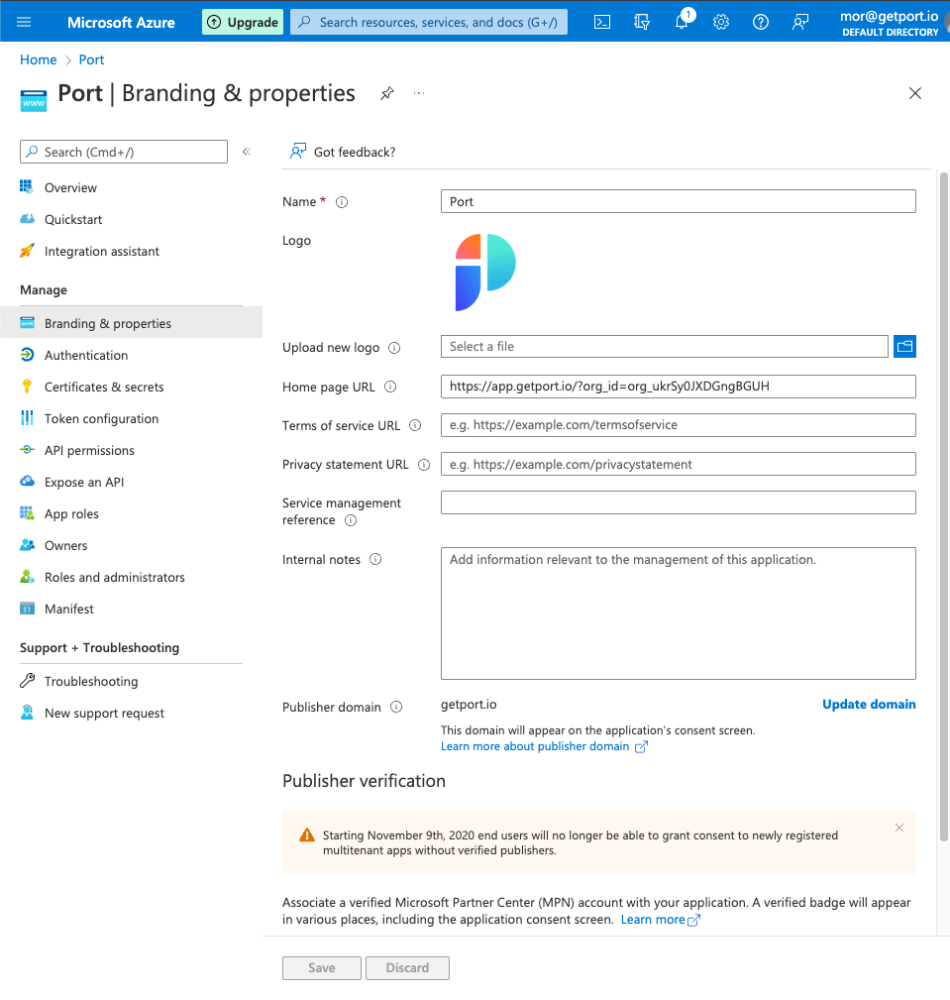
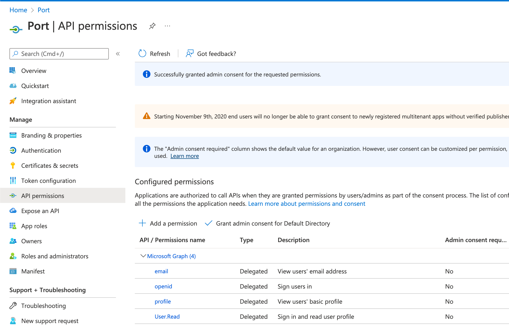
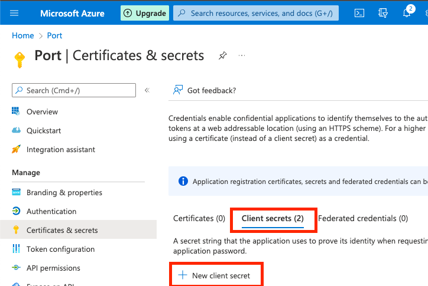
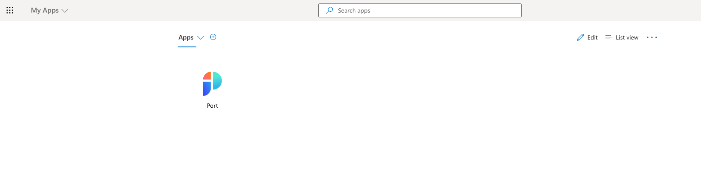

# How to configure AzureAD

Follow this step-by-step guide to configure the integration between Glint and Azure Active Directory.

:::info
In order to complete the process you will need to contact us to receive the information you require, as well as the information Glint requires from you. All is elaborated below in the following section.

:::

## Glint-AzureAd integration benefits

- Connect to the Glint application via an AzureAD app.
- Your AzureAD teams will be automatically synced with Glint upon a user sign-in.
- Set granular permissions on Glint according to your AzureAD groups.

## How to configure a Glint application in Azure AD

:::info

**Prerequisites**

To make the **Glint** app connection work, users who have access need to have a legal value in their `Email` field in Azure AD.

:::

### Step #1: Register a new application

1. In the Microsoft Azure Portal, go to `Azure Active Directory`.
2. Click on `App registrations`.

   

3. Click on `New registration` at the top of the page

   

4. Define the Glint application settings:

   4.1 `Name`: Insert a friendly name for the Glint app, like `Glint`.

   4.2 `Supported account types`: Please select the option that is appropriate for your organization.

   :::note
   For most use cases this would be **Accounts in this organizational directory only (Default Directory only - Single tenant)**.
   :::

   4.3 `Redirect URI`:

   - Set `Platform` to `Web`.
   - Set `URL` to `https://auth.useglint.io/login/callback`.

   

   4.4 Click `Register`.

### Step #2: Customize your Glint app with Login URL and Logo

1.  On the new Glint App page, click `Branding & Properties`.

    

    1.1 `Home page URL`: paste the following URL:

    ```text showLineNumbers
    https://auth.useglint.io/authorize?response_type=token&client_id=96IeqL36Q0UIBxIfV1oqOkDWU6UslfDj&connection={CONNECTION_NAME}&redirect_uri=https%3A%2F%2Fapp.useglint.io
    ```

    :::note
    We will provide your `{CONNECTION_NAME}` (Contact us on Slack/Intercom).
    :::

    1.2 Add the Glint logo (optional):

    

    1.3 `Publisher domain`: Select the domain matching **your** user emails (for example `useglint.io`).

    

    1.4 Click `Save`.

### Step #3: Configuring the application permissions

1. On the Glint App page, click `API Permissions`.

   

2. Click `Add a permission`:

   

3. On the `Microsoft APIs` tab:

   3.1 Click on `Microsoft Graph`

   

   3.2 Click on `Delegate Permissions`

   

   3.3 Search and mark the following permissions:

   - `email`, `openid`, `profile`, `User.read`.

   

   3.4 Click `Add permissions`.

   :::note
   (OPTIONAL) `Grant admin consent`: when users from your organization will first log in, they will be prompted to confirm the permissions specified here. You can click the `Grant admin consent for Default Directory` to automatically approve their permissions.
   :::

### Step #4: Configuring the application claims

1. On the Glint App page, click `Token configuration`:

   

2. Click `Add optional claim`:

   

3. Select `ID` as the token type and then select the `email` claim, then click `Add`:

   

   :::note
   Repeat the same process for `Access` and `SAML` (3 times total).
   :::

4. Your optional claims will look like this:

   

   :::info  
   If you wish to configure the `groups claim` to pull your AzureAD groups into Glint, please follow [How to allow pulling AzureAD groups to Glint](#how-to-allow-pulling-azuread-groups-to-glint).
   :::

### Step #5: Configuring application secret

1. On the Glint App page, click `Certificates & Secrets`:

   

2. On the `Client secrets` tab, click the `New client secret` button:

   

   2.1 `Description`: Enter a secret description, for example `Glint Login Client Secret`.

   2.2 `Expires`: Select when will the secret expires.

   :::danger
   Be sure to mark on your calendar the expiration date of the secret. The secret needs to be replaced before its expiration, otherwise login to Glint will be disabled.
   :::

   2.3 Click `Add`.

   A secret will be created and its Value will appear as shown in the image below. Immediately document the secret’s value because we will need it for our next step.

   :::danger COPY YOUR SECRET NOW
   Be advised that your secret will never appear again after you leave this page.
   :::

   

### Step #6: Providing the application information to Glint

Glint needs the following information for this process:

- The `Client Secret` value that you created on [Step 5: Configuring application secret](#step-5-configuring-application-secret).
- The `Application (Client) ID`, which appears on the Glint application overview page:


:::note
**Glint** will provide you the `CONNECTION_NAME` needed for the homepage URL of the App, as described on [Step 2](#step-2-customize-your-glint-app-with-login-url-and-logo).
:::

### Step #7: Exposing the application to your organization

1. Assigning the App to organization users and groups

   After the app setup is complete, you can proceed to assign it to your organization’s users and groups, by distributing it in your organization:

   1.1 Go to `Azure Active Directory`.

   1.2 Go to `Enterprise Applications`:

   

2. Click on the Glint app:

   

3. Click on `Users and Groups`:

   

4. Click `Add user/group`:

   

   4.1 Select users and groups you want to grant access to Glint.

   4.2 Click `Assign`.

5. Make the Glint application visible on the `myapplications` page:

   5.1 Go to `Azure Active Directory`.

   5.2 Go to `Enterprise Applications`.

   5.3 Click on the Glint app.

   5.4 Click on `Properties`:

   

   5.5 Set the application properties:

   - Mark `Enabled for users to sign-in?` as `Yes`.

   - Mark `Visible to users?` as `Yes`.

   :::note
   By default the `Assignment required?` flag is set to `No`, meaning any user with the Homepage URL to the Glint app can access it, even if the app isn’t directly assigned to them.
   Changing the flag to `Yes` means only users and groups the app is directly assigned to can use and access it.

   :::

   

   You should see the Glint app on the [https://myapplications.microsoft.com](https://myapplications.microsoft.com) dashboard:

   

   :::note
   Users can also manually access Glint by going to the App Homepage URL: `https://auth.useglint.io/authorize?response_type=token&client_id=96IeqL36Q0UIBxIfV1oqOkDWU6UslfDj&connection={CONNECTION_NAME}&redirect_uri=https%3A%2F%2Fapp.useglint.io`
   :::

---

## Permissions required to pull AzureAD groups to Glint

Glint can query the group membership of users who log in through the AzureAD SSO, and add their teams as team entities inside Glint. This allows the platform engineers to take advantage of both existing groups from AzureAD and teams created manually inside Glint to manage permissions and access to resources inside Glint's catalog.

**Important:** In order to import Azure AD groups into Glint, Glint will require the connection app to approve the `Directory.Read.All` permission
