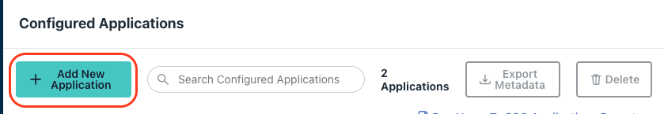
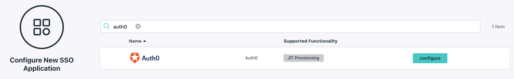
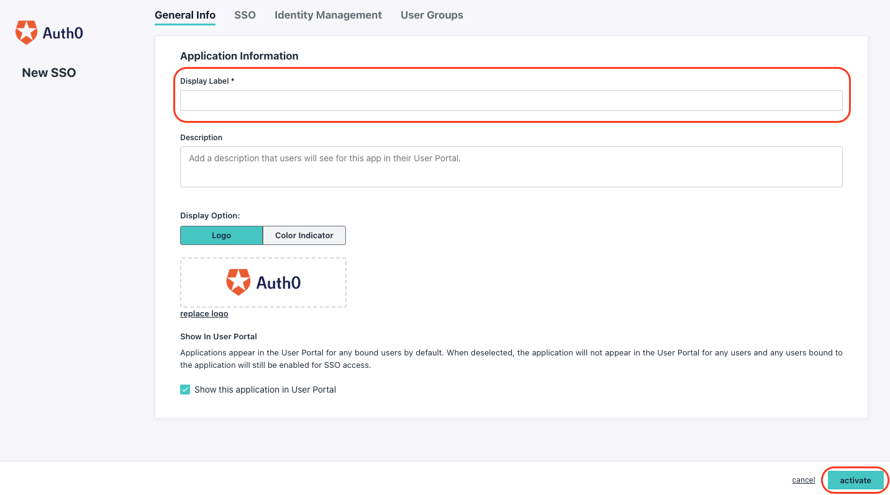
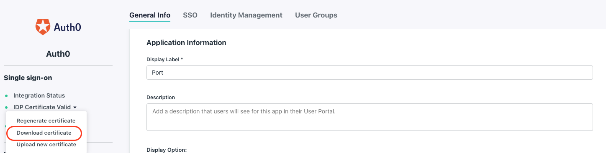
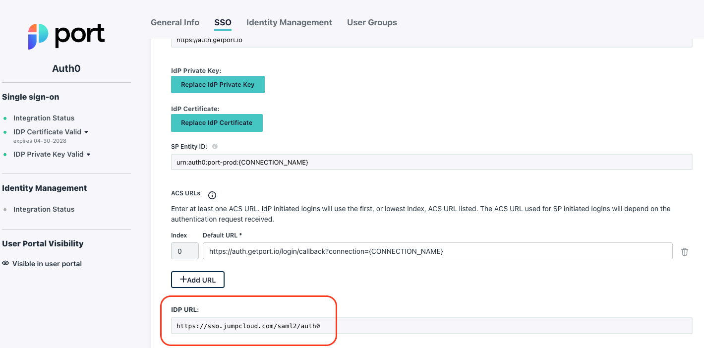
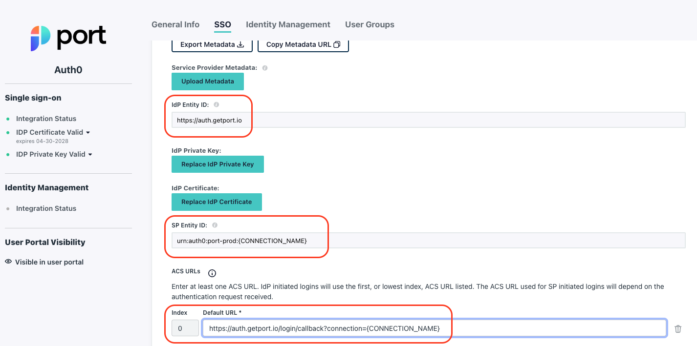
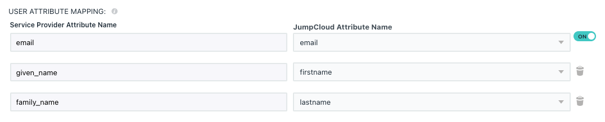
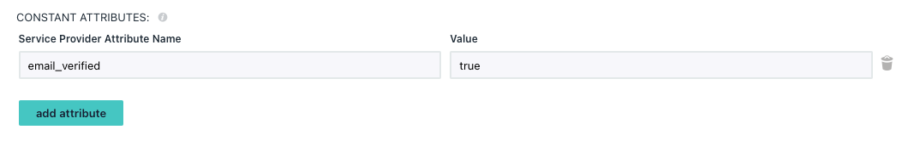
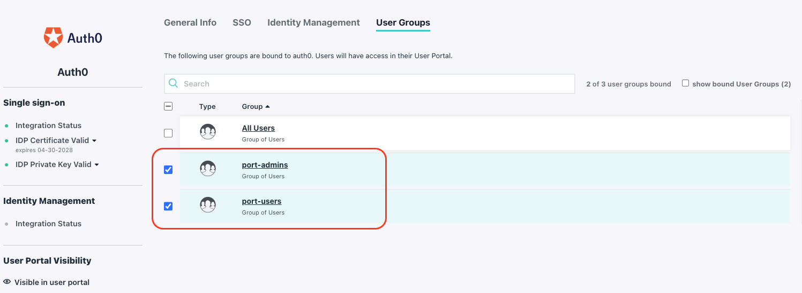
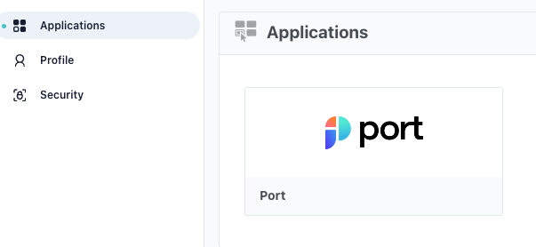

# How to configure JumpCloud

Follow this step-by-step guide to configure the integration between Glint and JumpCloud.

:::info
In order to complete the process you will need to contact Glint to deliver and receive information, as detailed in the guide below.
:::

## Glint-JumpCloud integration benefits ​

- Connect to the Glint application via a JumpCloud app;
- Your JumpCloud teams will be automatically synced with Glint, upon user sign-in;
- Set granular permissions on Glint according to your JumpCloud user groups.

## How to configure the JumpCloud app integration for Glint

### Step #1: Create a new JumpCloud application

1. In the Admin Portal, go to User Authentication -> SSO.
2. Click `Add New Application`.

3. In the search box type **Auth0**:

4. Define the initial Glint application settings:

   1. `Display Label`: Insert a name of your choice for the Glint app, like `Glint`.
   2. Add an icon (optional):

   

   
Glint Logo

   

   

   3. **(Optional)** In the SSO tab, change the default IDP URL suffix.
      

Click `activate`.

5. Click on the newly created application.

   1. Download the IDP Certificate:
      

   2. Copy the `IDP URL` from the SSO tab
      

6. Via intercom/slack, provide Glint with the downloaded `certificate.pem` file, and the copied `IDP URL`.

:::note
After providing the `certificate.pem` file and the the `IDP URL` to Glint, you will be provided with you with your `{CONNECTION_NAME}`. Replace the following occurrences with the provided value.
:::

:::tip
Most of the following steps involve editing the initial Glint app you created. Keep in mind you can always go back to it by opening the admin console and going to User Authentication -> SSO, the Glint app will appear in the application list.
:::

### Step #2: Configure your JumpCloud application

In the Glint app, go to the `SSO` menu and follow these steps:

1. Under `IdP Entity ID:` paste the following URL: `https://auth.useglint.io`

2. Under `SP Entity ID:` set: `urn:auth0:glint-prod:{CONNECTION_NAME}`.

3. Under `ACS URLs`, set: `https://auth.useglint.io/login/callback?connection={CONNECTION_NAME}`

Click `Save`.

### Step #3: Add user attributes to the app configuration

The `family_name` and `given_name` attributes are required. These are used by Glint to show the full name of a logged in user. To create these attributes follow these steps:

:::note
The `email` user attribute is created by default when creating the app.
Make sure the switch next to the `email` field is set to `on`.
:::

1. In the Glint app, go to the `SSO` tab, under the **User Attribute Mapping** section:
2. Click on `add attribute`.
3. Set the `Service Provider Attribute Name` to `given_name`
4. In the `Value` field enter the value: `firstname`
5. Click on `add attribute` again.
6. Set the `Service Provider Attribute Name` to `family_name`
7. In the `Value` field enter the value: `lastname`

### Step #4: Add `email_verified` constant attribute to the Glint App

The use of Auth0 requires that JumpCloud passes to Glint an `email_verified` field upon user login. JumpCloud does not store and expose that field by default, so in this step, you are going to configure that field and apply it to all users in your JumpCloud account.

1. In the Glint app, go to the `SSO` tab, under the **Constant Attributes** section:
2. Click on `add attribute`.
3. Set the `Service Provider Attribute Name` to `email_verified`
4. In the `Value` field enter the value: `true`

:::note
It is also possible to manually change the value of the `email_verified` field to `true` for each user that requires access to Glint in your organization. However, granting access manually to a large number of users is not scalable.
:::

### Step #5: Exposing the application to your organization

1. In the Glint app, go to the `User Groups` tab.
2. Select the user groups you want to expose the Glint app to:

   

3. Click `Save`.

After completing these steps, users with roles that the Glint app was assigned to, will see the Glint app in their Portal and upon clicking it, will be logged in to Glint:

---

## How to allow pulling JumpCloud Groups to Glint

:::note
This stage is **OPTIONAL** and is required only if you wish to pull all of your JumpCloud Groups into Glint inherently.

**Benefit:** managing permissions and user access on Glint.  
**Outcome:** for every user that logs in, we will automatically get their associated JumpCloud Groups, according to your definition in the settings below.
:::

To allow automatic Groups Groups support in Glint, please follow these steps:

1. In the Glint app, go to the `SSO` tab, under the **Group Attributes** section

2. Check the `include group attributes` box

3. Set the group attributes' name: `memberOf`

4. Click `Save`.
